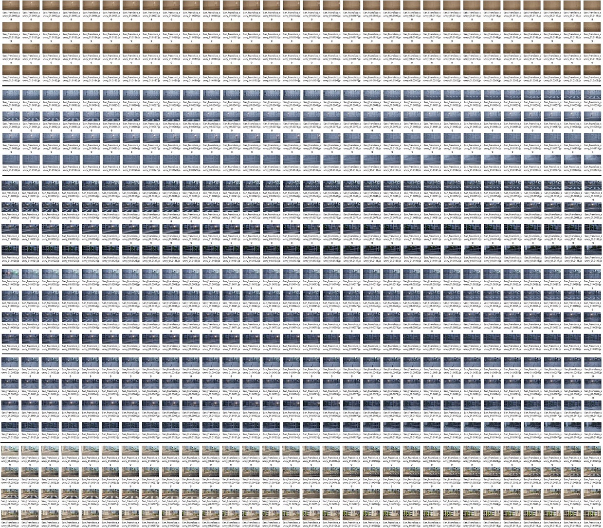
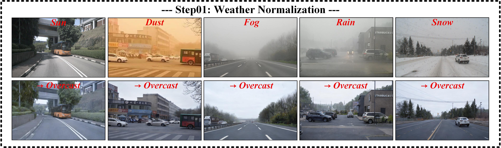
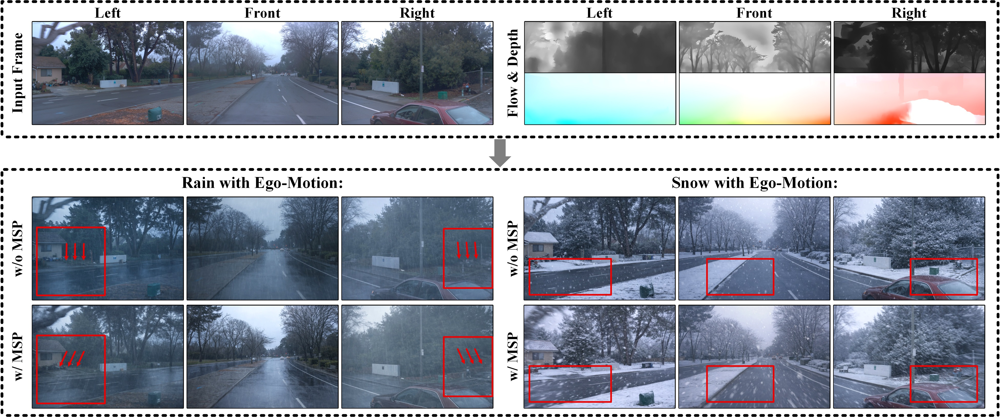

# DriveWeather: A Motion-Consistent Dynamic Weather Synthesis Framework via Video-to-Video Diffusion for Autonomous Driving

<p align="center">
  <a href="#dataset">Dataset</a> •
  <a href="#citation">Citation</a>
</p>

---

## Overview

DriveWeather is a **video-to-video conditional diffusion** framework for synthesizing **realistic, temporally continuous, and ego-motion-consistent** dynamic weather effects (e.g., rain streaks and snow particles) in autonomous driving videos.  
It explicitly models **ego-motion states** and **scene structure** to generate **motion-consistent dynamic weather** while preserving the underlying scene content.

---


## Method

<p align="center">
  
</p>
<p align="center"><em>Figure 1. Overview of DriveWeather.</em></p>

**Core components**
- **MSP**: perceives ego-motion states and scene structure; provides motion-aware conditions for diffusion.
- **DACB**: calibrates generation and reduces artifacts/hallucinations in low-texture regions.

---

## Dataset

<p align="center">
  
</p>
<p align="center"><em>Figure 2. Dataset demo.</em></p>

---

## Results

<p align="center">
  
</p>
<p align="center"><em>Figure 3. Step1 results.</em></p>

<p align="center">
  
</p>
<p align="center"><em>Figure 4. Step2 results.</em></p>

<p align="center">
  
</p>
<p align="center"><em>Figure 5. Motion-Consistent results.</em></p>

<p align="center">
  
</p>
<p align="center"><em>Figure 6. Results of adjusting different optical flow intensities.</em></p>


---

## Installation

### 1) Clone
```bash
git clone https://github.com/manbo-syjiang/driveweather-diffusion.git
