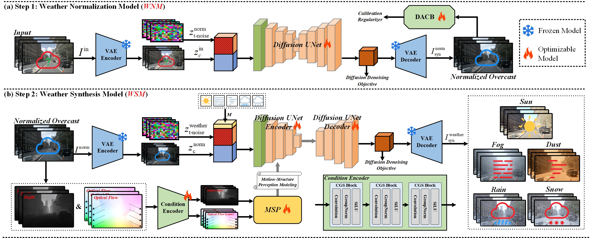

# DriveWeather: A Motion-Consistent Dynamic Weather Synthesis Framework via Video-to-Video Diffusion for Autonomous Driving

<p align="center">
  
</p>

<p align="center">
  <a href="#overview">Overview</a> •
  <a href="#method">Method</a> •
  <a href="#experiments">Experiments</a> •
  <a href="#installation">Installation</a> •
  <a href="#data-preparation">Data</a> •
  <a href="#training">Training</a> •
  <a href="#inference">Inference</a> •
  <a href="#evaluation">Evaluation</a> •
  <a href="#citation">Citation</a>
</p>

---

## Overview

DriveWeather is a **video-to-video conditional diffusion** framework for synthesizing **realistic, temporally continuous, and ego-motion-consistent** dynamic weather effects (e.g., rain streaks and snow particles) in autonomous driving videos.  
It explicitly models **ego-motion states** and **scene structure** to generate **motion-consistent dynamic weather** while preserving the underlying scene content.

---

## Method

<p align="center">
  
</p>
<p align="center"><em>Figure 1. Overview of DriveWeather. (Replace this caption with your paper caption.)</em></p>

**Core components**
- **MSP**: perceives ego-motion states and scene structure; provides motion-aware conditions for diffusion.
- **DACB**: calibrates generation and reduces artifacts/hallucinations in low-texture regions.

---

## Experiments

### Qualitative Results
<p align="center">
  
</p>
<p align="center"><em>Figure 2. Qualitative comparison / main results.</em></p>

<p align="center">
  
</p>
<p align="center"><em>Figure 3. Motion-consistent weather dynamics (ego-motion-consistent visual drift).</em></p>


---

## Installation

### 1) Clone
```bash
git clone https://github.com/<your-org-or-name>/DriveWeather.git
cd DriveWeather
